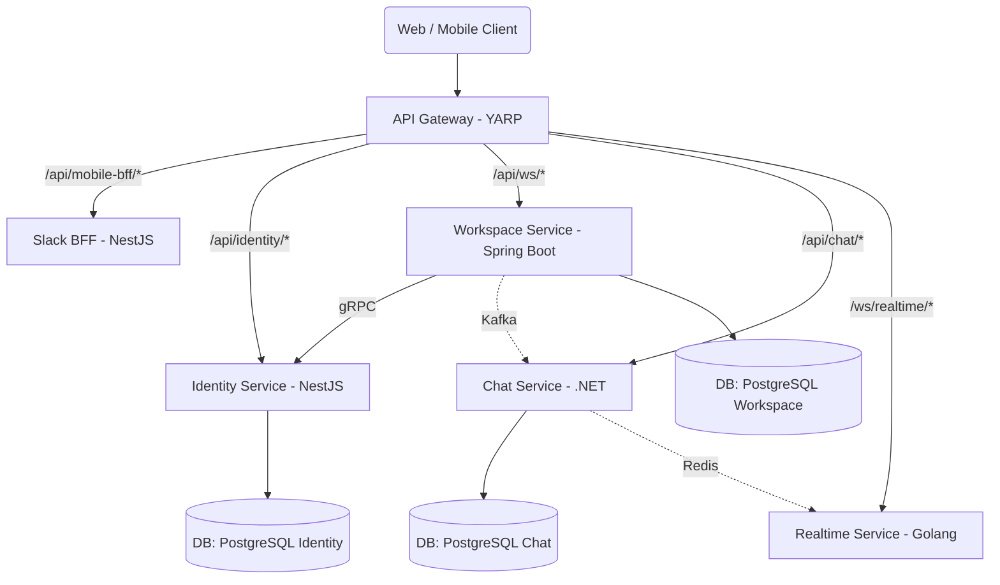

# 🚀 Slack Clone Backend - Tài Liệu Onboarding Cho Developer Mới

Chào mừng bạn tham gia dự án Slack Clone Backend! Tài liệu này sẽ cung cấp cho bạn một cái nhìn tổng quan, chi tiết và dễ hiểu nhất về hệ thống các microservices hiện tại, cách chúng giao tiếp với nhau và cách để bạn có thể bắt tay vào làm việc.

---

## 1. Tổng Quan Kiến Trúc (Architecture Overview)

Hệ thống được thiết kế theo kiến trúc **Microservices** (đa ngôn ngữ - polyglot), trong đó mỗi service đảm nhận một nghiệp vụ riêng biệt và được viết bằng một ngôn ngữ/công nghệ tối ưu nhất cho nghiệp vụ đó.
Tất cả các truy cập từ bên ngoài (Web/Mobile) đều đi qua **API Gateway**.



---

## 2. Chi Tiết Các Microservices

Hệ thống bao gồm 5 cấu phần chính nằm trong các thư mục tương ứng:

### 2.1. YarpGateway (`api-gateway/YarpGateway`)
- **Ngôn ngữ/Công nghệ**: C# .NET (YARP - Yet Another Reverse Proxy).
- **Chức năng**:
  - Nhận mọi request từ Internet.
  - Xử lý **Routing** (điều hướng request tới các service tương ứng).
  - Phân tích và xác thực **JWT token** (AuthorizationPolicy).
  - Điều tiết lưu lượng **Rate Limiting**.
- **Port nội bộ**: Thường map tới các port 3300, 3001, 3002, 3003, 3004 cho các service con.

### 2.2. Slack BFF (`api-gateway/slack-bff`)
- **Ngôn ngữ/Công nghệ**: Node.js / NestJS.
- **Port định tuyến**: `3300`
- **Chức năng**: Dùng mẫu thiết kế Backend-For-Frontend để gộp các tính năng, tùy chỉnh riêng cho ứng dụng Mobile. Giảm thiểu số lượng request mà Mobile app phải gọi để lấy dữ liệu.

### 2.3. Identity Service (`identity-service(nest)`)
- **Ngôn ngữ/Công nghệ**: Typescript / NestJS / TypeORM.
- **Port định tuyến**: `3001` (Rest API) và `9090` (gRPC server).
- **Chức năng**: Quản lý tài khoản (Đăng nhập, Đăng ký, Cấp phát JWT token). Lưu trữ thông tin User. 
- **DB**: Sử dụng Database PostgreSQL.

### 2.4. Workspace Service (`workspace-service`)
- **Ngôn ngữ/Công nghệ**: Java 21 / Spring Boot 3 / Hibernate.
- **Port định tuyến**: `3002`.
- **Chức năng**: Quản lý không gian làm việc (Workspace, Channels, Members).
- **Giao tiếp**:
  - Kết nối tới Postgres Database (`slack_workspace`).
  - Gửi cấu trúc thông qua **Kafka** (`workspace-events`) để đồng bộ với các service khác.
  - Có gọi **gRPC client** sang `user-service` (Identity Service) ở port `9090`.

### 2.5. Chat Service (`chat-service`)
- **Ngôn ngữ/Công nghệ**: C# .NET Core / Clean Architecture.
- **Port định tuyến**: `3003`.
- **Chức năng**: Lưu trữ tin nhắn, lịch sử trò chuyện.
- **Giao tiếp**:
  - Sử dụng chung hạ tầng Kafka (Topic: `workspace-events`) để nhận cập nhật từ Workspace.
  - Sử dụng Redis làm Cache (`InstanceName: ChatService_`).

### 2.6. Realtime Service (`realtime-service(golang)`)
- **Ngôn ngữ/Công nghệ**: Golang / WebSockets.
- **Port định tuyến**: `3004`
- **Chức năng**: Đẩy thông báo theo thời gian thực (real-time notification) đến trình duyệt/mobile của User.
- **Cơ chế**: Dùng WebSocket duy trì kết nối. Dùng Redis Pub/Sub để lắng nghe sự kiện từ các services khẩn/chat và broadcast xuống client.

---

## 3. Hạ Tầng & Database (Infrastructure)

### Thông qua Docker Compose (`docker-compose.yml`)
Hệ thống sử dụng Docker để dựng các Core Services dùng chung:
- **Redis (`port 6379`)**: Dùng cho Caching và Pub/Sub.
- **Kafka & Zookeeper (`port 9092 & 2181`)**: Message Broker dùng cho bất đồng bộ (Async Event-Driven Communication).
- **Kafdrop (`port 9000`)**: Giao diện Web UI để theo dõi Kafka, quản lý Topics/Messages.

> Khuyến nghị: Bạn **cần** cài đặt PostgreSQL cục bộ trên máy ở `port 5432` hoặc tạo bằng Docker với tài khoản mặc định `postgres/300304` để hệ thống kết nối vì PostgreSQL không có sẵn trong file Docker-compose.

---

## 4. Luồng Giao Tiếp Nội Bộ (Inter-service Communication)

Nhờ kiến trúc Polyglot, các service ưu tiên việc chia sẻ qua 2 cách:
1. **Đồng bộ (Sync)**: Sử dụng **gRPC**. Ví dụ: `Workspace Service` cần validate thông tin Người Dùng -> gọi gRPC sang `Identity Service` (port 9090) cho tốc độ mili-giây siêu nhanh.
2. **Bất đồng bộ (Async)**: Sử dụng **Kafka** và **Redis**. Ví dụ: Có 1 người dùng được thêm vào workspace -> `Workspace Service` lưu DB sau đó bắn 1 event lên Kafka -> `Chat Service` bắt được event này tiến hành update phân quyền đọc tin nhắn.

---

## 5. Hướng Dẫn Setup & Chạy Lần Đầu 

### Bước 1: Khởi động các hạ tầng nền
- Hãy đảm bảo bạn đã chạy Docker. Mở terminal tại thư mục gốc và chạy:
  ```bash
  docker-compose up -d
  ```
  Lệnh này sẽ khởi động Kafka, Zookeeper, Redis và Kafdrop.

### Bước 2: Chuẩn bị Database
- Cài đặt và bật PostgreSQL (`localhost:5432`). Tạo các database trống cần thiết: `slack_workspace`, `slack_chat`... (Kiểm tra lại tên DB trong `appsettings.json` của C# và `application.properties` của Spring Boot).

### Bước 3: Build & Chạy từng Service
Với mỗi ngôn ngữ, hãy mở terminal riêng biệt (khuyên dùng tính năng multiple terminals của IDE hoặc Tmux/Tabs):
- **YarpGateway**: `cd api-gateway/YarpGateway` ->  `dotnet run`
- **Chat Service**: `cd chat-service` -> `dotnet run`
- **Identity Service**: `cd identity-service(nest)` -> `npm install` -> `npm run start:dev`
- **Workspace Service**: Mở bằng IntelliJ IDEA hoặc chạy lệnh maven/bằng script: `./mvnw spring-boot:run`
- **Realtime Service**: `cd realtime-service(golang)` -> `go run cmd/server/main.go`

### Bước 4: Kiểm tra Gateway
Tất cả các API call của bạn trên Postman (hoặc Frontend) lúc này **CHỈ GỌI** thông qua cổng của Yarp Gateway. Ví dụ bạn muốn gọi `/api/chat/messages` thì gọi trực tiếp qua port của YarpGateway thay vì gọi trực tiếp port 3003 của Chat Service.

---

**Quy tắc làm việc (Best Practices):**
- **Chỉ thêm Code vào Service tương ứng**: Nếu nghiệp vụ liên quan đến WebSocket, chỉ sửa file Go. Nghiệp vụ chat, sửa file C#. Tránh làm lẫn lộn ranh giới các microservice.
- **API Gateway File:** Lần nào bạn có API route mới, đảm bảo `appsettings.json` trong thư mục `YarpGateway` đã cấu hình rule để bắt prefix của API đấy (như `/api/chat/...` -> Chat Service đằng sau).
