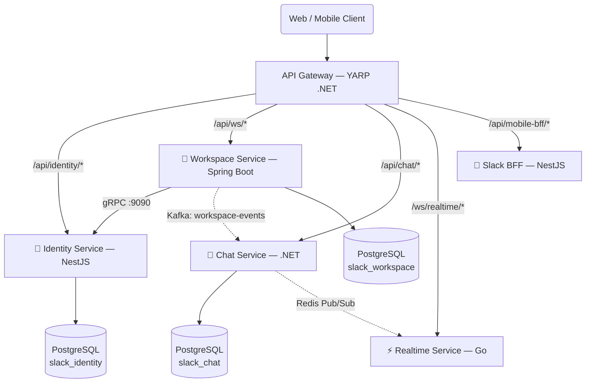

<div align="center">

# 💬 Slack Clone — Polyglot Microservices Platform

**Một nền tảng nhắn tin thời gian thực được xây dựng theo kiến trúc Microservices đa ngôn ngữ, thể hiện các kỹ thuật backend phức tạp trong môi trường phân tán.**

[](.)
[](.)
[](.)

<br/>


</div>

---

## 📖 Tổng Quan

Dự án này là một bản clone của Slack — nền tảng nhắn tin cho doanh nghiệp — được xây dựng với mục tiêu học và thực hành các **kỹ thuật backend phân tán** ở mức độ production. Thay vì tập trung vào số lượng tính năng, trọng tâm của dự án nằm ở kiến trúc hệ thống, khả năng mở rộng và tính nhất quán dữ liệu.

Điểm đặc biệt của dự án là sử dụng **Polyglot Architecture** — mỗi service được viết bằng ngôn ngữ và công nghệ tối ưu nhất cho bài toán của nó: NestJS cho authentication, Spring Boot cho business logic phức tạp, .NET cho messaging, Go cho high-concurrency WebSocket, và Flutter cho cross-platform frontend.

### 🎯 Mục Tiêu Kỹ Thuật

- Ứng dụng thực tế **Domain-Driven Design (DDD)** và **Clean Architecture**
- Triển khai **CQRS (Command Query Responsibility Segregation)** trong môi trường phân tán
- Xây dựng **Event-Driven Communication** với Kafka và Redis Pub/Sub
- Đảm bảo **Data Consistency** giữa các service qua Outbox Pattern và Saga Pattern
- Xử lý hàng nghìn **WebSocket connections** đồng thời với Go Goroutines

---

## 🏗️ Kiến Trúc Hệ Thống

Toàn bộ request từ Client (Web/Mobile) đều đi qua một điểm duy nhất là **API Gateway**, không có service nào được expose trực tiếp ra ngoài.

```
                    ┌─────────────────────────────────┐
                    │     Web / Mobile Client          │
                    └──────────────┬──────────────────┘
                                   │
                                   ▼
                    ┌──────────────────────────────────┐
                    │   API Gateway (YARP - .NET 9)    │
                    │  ✦ JWT Authentication            │
                    │  ✦ Rate Limiting                 │
                    │  ✦ Header Injection              │
                    │  ✦ Request Routing               │
                    └──────┬──────────┬───────────────┘
                           │          │
          ┌────────────────┼──────────┼────────────────────┐
          │                │          │                    │
          ▼                ▼          ▼                    ▼
  ┌──────────────┐  ┌──────────┐  ┌──────────┐  ┌──────────────┐
  │   Identity   │  │Workspace │  │  Chat    │  │  Realtime    │
  │   Service    │  │  Service │  │ Service  │  │  Service     │
  │  (NestJS)    │  │  (Java)  │  │ (.NET)   │  │   (Go)       │
  │  Port: 3001  │  │Port:3002 │  │Port:3003 │  │  Port: 3004  │
  └──────┬───────┘  └─────┬────┘  └────┬─────┘  └──────┬───────┘
         │                │            │               │
         │    gRPC ←──────┘            │               │
         │                             │               │
         │         Kafka ──────────────┘               │
         │                                             │
         │              Redis Pub/Sub ─────────────────┘
         │
  ┌──────▼───────────────────────────────────────────────┐
  │           Infrastructure (Docker Compose)            │
  │     Redis | Apache Kafka | Zookeeper | Kafdrop       │
  └──────────────────────────────────────────────────────┘
```

### 🗺️ Sơ Đồ Kiến Trúc Chi Tiết



---

## 🛠️ Tech Stack & Services

| Service | Công Nghệ | Cổng | Nhiệm Vụ |
|:--------|:----------|:-----|:---------|
| **API Gateway** | C# .NET 9, YARP | `3000` | Routing, JWT Auth, Rate Limiting |
| **Identity Service** | NestJS, TypeScript, PostgreSQL | `3001` / gRPC `9090` | Auth, User Management |
| **Workspace Service** | Java 21, Spring Boot, Redis | `3002` | Workspace, Channel, Invitation |
| **Chat Service** | C# .NET 9, MediatR, PostgreSQL | `3003` | Messages, Threads, Reactions |
| **Realtime Service** | Go, gorilla/websocket | `3004` | WebSocket, Presence System |
| **Slack BFF** | NestJS | `3300` | Backend-for-Frontend (Mobile) |
| **Frontend** | Flutter (Dart) | — | Cross-platform Client App |

### 🔧 Infrastructure

| Thành Phần | Mục Đích | Cổng |
|:-----------|:---------|:-----|
| **PostgreSQL** | Persistent storage (mỗi service có DB riêng) | `5432` |
| **Apache Kafka** | Async event-driven messaging | `9092` |
| **Redis** | Caching + Pub/Sub channel | `6379` |
| **Kafdrop** | Kafka Web UI (monitoring) | `9000` |

---

## ✨ Engineering Highlights

Dự án này là nơi triển khai thực tế các pattern phức tạp trong hệ thống phân tán:

### 1. 🔐 Centralized Authentication (JWT tại API Gateway)
Gateway giải mã JWT và inject `x-user-id`, `x-user-email` vào header. Các downstream service **không cần biết JWT là gì** — chỉ đọc header có sẵn.

### 2. 📡 Dual Communication Protocol
- **gRPC (Đồng bộ)**: Workspace Service → Identity Service khi cần validate user trong luồng mời thành viên. Nhanh hơn REST ~7-10 lần nhờ Binary Protocol (Protobuf).
- **Kafka (Bất đồng bộ)**: `MEMBER_JOINED` event từ Workspace → Chat Service tự đồng bộ quyền truy cập channel. Services hoàn toàn decoupled.

### 3. 📦 Outbox Pattern (Không mất sự kiện)
Identity Service sử dụng **Transactional Outbox Pattern**: ghi User và event vào cùng một transaction DB. Background Worker poll và gửi lên broker sau — đảm bảo at-least-once delivery dù hệ thống crash giữa chừng.

### 4. ⚡ Redis Bridge (Chat ↔ WebSocket)
Chat Service không biết WebSocket tồn tại. Khi có tin nhắn mới, nó chỉ `PUBLISH` lên Redis channel. Realtime Service (Go) `PSubscribe` pattern `ChatService_channel:*` và push về đúng client — kiến trúc cực kỳ loose-coupled.

### 5. 🏛️ DDD + CQRS (Workspace Service)
Workspace Service là showcase của **Domain-Driven Design** với đầy đủ: Aggregates, Value Objects, Domain Events, Repository interfaces. **CQRS** tách hoàn toàn Commands (write) và Queries (read).

### 6. 🦾 Go Goroutines (10k Connections)
Mỗi WebSocket connection = 2 goroutines (ReadPump + WritePump). 10,000 users đồng thời chỉ cần ~20MB RAM — không thể làm được với Java threads hay Node.js event loop đơn luồng.

### 7. 📄 Cursor-based Pagination (Chat History)
Thay vì `OFFSET/LIMIT` (chậm khi data lớn), Chat Service dùng **Cursor Pagination** theo `created_at` — hiệu suất không đổi dù database có hàng triệu tin nhắn. Đây là cách Slack và Discord thực sự implement.

---

## 📦 Cấu Trúc Dự Án

```
Slack/
│
├── Backend/
│   ├── api-gateway/
│   │   ├── YarpGateway/          # 🛡️  API Gateway — C# .NET, YARP Reverse Proxy
│   │   └── slack-bff/            # 📱  BFF — NestJS, tổng hợp API cho Mobile
│   │
│   ├── identity-service(nest)/   # 🔐  Identity Service — NestJS, TypeScript
│   ├── workspace-service/        # 🏢  Workspace Service — Java 21, Spring Boot
│   ├── chat-service/             # 💬  Chat Service — C# .NET 9, Clean Architecture
│   ├── realtime-service(golang)/ # ⚡  Realtime Service — Go, WebSocket
│   │
│   ├── docker-compose.yml        # 🐳  Khởi động Redis, Kafka, Zookeeper, Kafdrop
│   └── DEVELOPER_ONBOARDING.md  # 📚  Tài liệu dành cho Developer mới
│
└── front_end/                    # 📱  Flutter App — Cross-platform Client
    ├── lib/
    │   ├── core/                 #    DI, Router, Theme, Network config
    │   ├── features/             #    Feature-first structure
    │   │   ├── auth/             #    Đăng nhập / Đăng ký / OTP
    │   │   ├── workspace/        #    Workspace list & management
    │   │   ├── channels/         #    Channel list & browsing
    │   │   ├── chat/             #    Màn hình nhắn tin chính
    │   │   ├── profile/          #    Hồ sơ người dùng
    │   │   └── user/             #    User-related features
    │   └── shared/               #    Widget, Model, Util dùng chung
    └── pubspec.yaml
```

---

## 🔌 Services Chi Tiết

### 🛡️ API Gateway (`api-gateway/YarpGateway`)
> **C# .NET 9 · YARP Reverse Proxy · JWT · Rate Limiting**

Cổng bảo vệ duy nhất của toàn bộ hệ thống. Mọi request đều phải đi qua đây.

**Tính năng:**
- **Intelligent Routing**: Định tuyến 100% bằng config JSON, không cần code controller
- **JWT Authentication**: Xác thực tập trung, inject `x-user-id` header cho downstream services
- **Rate Limiting**: Fixed Window — tối đa 5 req/10 giây cho các endpoint nhạy cảm
- **CORS Management**: Quản lý tập trung cho toàn hệ thống

📖 [Chi tiết → api-gateway/YarpGateway/README.md](./Backend/api-gateway/YarpGateway/README.md)

---

### 🔐 Identity Service (`identity-service(nest)`)
> **NestJS · TypeScript · PostgreSQL · gRPC Server · JWT**

Quản lý toàn bộ vòng đời tài khoản người dùng.

**Tính năng:**
- Full Auth Flow: Register → Email OTP Verify → Login
- Dual Token System: Access Token (15 phút) + Refresh Token (7 ngày) lưu DB
- Password Management: Forgot/Reset qua OTP, Change Password với xác thực cũ
- gRPC Server (port `9090`): Phục vụ internal service calls
- Outbox Pattern: Đảm bảo `USER_CREATED` event không bao giờ bị mất

📖 [Chi tiết → identity-service(nest)/README.md](./Backend/identity-service(nest)/README.md)

---

### 🏢 Workspace Service (`workspace-service`)
> **Java 21 · Spring Boot 3 · DDD · CQRS · gRPC Client · Kafka Producer · Redis**

Service phức tạp nhất về mặt nghiệp vụ — quản lý Workspace, Channel, và hệ thống mời thành viên.

**Tính năng:**
- Workspace & Channel CRUD với phân quyền (Owner / Admin / Member)
- Invitation Flow: Gửi email mời → Validate token → Accept → Publish Kafka event
- DDD đầy đủ: Aggregates, Value Objects, Domain Events, Repository Pattern
- CQRS: Commands (write) và Queries (read) hoàn toàn tách biệt
- Sidebar API: Tối ưu hóa query dữ liệu hiển thị cho màn hình chat

📖 [Chi tiết → workspace-service/README.md](./Backend/workspace-service/README.md)

---

### 💬 Chat Service (`chat-service`)
> **C# .NET 9 · Clean Architecture · MediatR · CQRS · Redis Pub/Sub · Kafka Consumer**

Engine xử lý tin nhắn — lưu trữ, truy xuất và kích hoạt luồng real-time.

**Tính năng:**
- Messages CRUD: Send, Edit, Soft Delete
- Thread System: Parent → Reply hierarchy
- Reaction System: Toggle emoji reactions
- Pin Messages: Ghim/bỏ ghim tin nhắn quan trọng
- Cursor-based Pagination: Hiệu suất ổn định với hàng triệu records
- MediatR Pipeline Behavior: Auto channel authorization cho 100% operations
- Redis Pub/Sub Bridge: Publish event → Realtime Service push WebSocket

📖 [Chi tiết → chat-service/README.md](./Backend/chat-service/README.md)

---

### ⚡ Realtime Service (`realtime-service(golang)`)
> **Go · gorilla/websocket · Redis Pub/Sub · Goroutines**

Trạm điều phối WebSocket — duy trì hàng nghìn kết nối và đẩy tin nhắn trong milliseconds.

**Tính năng:**
- Room-based Broadcasting: Push tin nhắn đến đúng người trong đúng channel
- Presence System: Online/Offline tracking qua Redis TTL
- Client Command Router: join/leave/typing/mark_read actions
- Heartbeat: Ping/Pong mỗi 20 giây để dọn dẹp ghost connections
- Anti-echo: Người gửi không nhận lại tin nhắn của mình
- Zero Database: Hoàn toàn in-memory + Redis, khởi động trong ~50ms

📖 [Chi tiết → realtime-service(golang)/README.md](./Backend/realtime-service(golang)/README.md)

---

### 📱 Frontend (`front_end`)
> **Flutter · Dart · flutter_bloc · go_router · Dio · WebSocket**

> ⚠️ **Đang trong quá trình phát triển** — Một số màn hình chưa hoàn thiện.

Ứng dụng cross-platform (Android, iOS, Desktop, Web) được xây dựng bằng Flutter.

**Tech Stack:**
| Package | Mục Đích |
|:--------|:---------|
| `flutter_bloc` | State Management |
| `go_router` | Navigation & Deep Linking |
| `dio` | HTTP Client (REST API) |
| `flutter_secure_storage` | Lưu trữ token an toàn |
| `get_it` | Dependency Injection |
| `pinput` | OTP Input Widget |
| `jwt_decoder` | Decode JWT payload |
| `talker` | Logging & Debug |

**Features đang phát triển:**
- `auth` — Đăng nhập, Đăng ký, Xác minh OTP Email
- `workspace` — Danh sách và quản lý workspace
- `channels` — Sidebar channel, browse channels
- `chat` — Màn hình nhắn tin chính
- `profile` — Hồ sơ người dùng

---

## 🚀 Hướng Dẫn Chạy Dự Án

### Yêu Cầu Hệ Thống

| Công Cụ | Phiên Bản Tối Thiểu | Dùng Cho |
|:--------|:-------------------|:---------|
| Docker & Docker Compose | Latest | Kafka, Redis, Zookeeper |
| PostgreSQL | 14+ | Tất cả services |
| Node.js | 20+ | Identity Service |
| Java JDK | 21 | Workspace Service |
| .NET SDK | 9.0 | Chat Service, API Gateway |
| Go | 1.21+ | Realtime Service |
| Flutter SDK | 3.x | Frontend |

---

### Bước 1: Khởi Động Hạ Tầng (Infrastructure)

```bash
cd Backend

# Khởi động Redis, Kafka, Zookeeper, Kafdrop
docker-compose up -d
```

Kiểm tra:
- **Kafdrop UI**: http://localhost:9000 (Giao diện quản lý Kafka)
- **Redis**: `localhost:6379`
- **Kafka Broker**: `localhost:9092`

---

### Bước 2: Chuẩn Bị Database

Cài đặt PostgreSQL và tạo 3 database trống:

```sql
CREATE DATABASE slack_identity;
CREATE DATABASE slack_workspace;
CREATE DATABASE slack_chat;
```

> Schema sẽ được tự động tạo khi khởi động từng service lần đầu (TypeORM sync / Hibernate DDL / EF Core Migrations).

---

### Bước 3: Khởi Động Các Services

Mở **5 terminal riêng biệt** và chạy theo thứ tự:

**① API Gateway** (Nên chạy sau cùng)
```bash
cd Backend/api-gateway/YarpGateway
dotnet run
# Gateway sẵn sàng tại: http://localhost:3000
```

**② Identity Service**
```bash
cd Backend/identity-service(nest)
npm install
npm run start:dev
# REST: http://localhost:3001 | gRPC: :9090
```

**③ Workspace Service**
```bash
cd Backend/workspace-service
./mvnw spring-boot:run
# API: http://localhost:3002
```

**④ Chat Service**
```bash
cd Backend/chat-service
dotnet run
# API: http://localhost:3003
```

**⑤ Realtime Service**
```bash
cd Backend/realtime-service(golang)
go run cmd/server/main.go
# HTTP: http://localhost:3004 | WS: ws://localhost:3004/ws
```

---

### Bước 4: Kiểm Tra Hệ Thống

Tất cả API calls phải đi qua **API Gateway** (`localhost:3000`):

```bash
# Test đăng ký tài khoản (Public endpoint, không cần token)
curl -X POST http://localhost:3000/api/identity/public/auth/register \
  -H "Content-Type: application/json" \
  -d '{"email": "test@example.com", "password": "password123"}'
```

---

### 📖 Swagger API Documentation

| Service | URL |
|:--------|:----|
| Identity Service | http://localhost:3001/swagger |
| Workspace Service | http://localhost:3002/api/v1/swagger-ui.html |
| Chat Service | http://localhost:3003/swagger |

---

## 🔄 Luồng Dữ Liệu Quan Trọng

### Luồng Gửi Tin Nhắn (Real-time Flow)

```
Flutter App
    │ POST /api/chat/messages (qua Gateway)
    ▼
API Gateway ── JWT Verify ──► Chat Service (.NET)
                                   │
                                   ├── Lưu tin nhắn vào PostgreSQL
                                   │
                                   └── PUBLISH "ChatService_channel:{id}"
                                            │
                                            ▼
                                       Redis Pub/Sub
                                            │
                                            ▼
                                   Realtime Service (Go)
                                            │
                                            └── Push WebSocket đến
                                                tất cả client trong channel
```

### Luồng Mời Thành Viên (Invitation Flow)

```
Admin gửi lời mời
    │ POST /api/ws/invitations/workspace/{id}
    ▼
Workspace Service
    │── gRPC → Identity Service: "Email này đã có account chưa?"
    │── Sinh Invitation JWT Token
    │── Lưu invitation vào DB
    └── Gửi email kèm link có token

Người được mời click link
    │ GET /api/ws/invitations/validate?token=...
    ▼
Workspace Service ── Validate token ──► Trả về thông tin workspace + isUserExist

Người dùng chấp nhận
    │ POST /api/ws/invitations/accept
    ▼
Workspace Service
    │── Thêm User vào workspace_members
    └── PUBLISH "MEMBER_JOINED" lên Kafka
                │
                ▼
          Chat Service (Consumer)
                └── Thêm user vào channel_members
                    (User giờ có quyền đọc tin nhắn)
```

---

## 🌟 Điểm Nổi Bật Kỹ Thuật

| Pattern / Kỹ Thuật | Được Áp Dụng Ở |
|:-------------------|:---------------|
| Domain-Driven Design (DDD) | Workspace Service |
| CQRS với MediatR | Chat Service, Workspace Service |
| Outbox Pattern | Identity Service |
| Transactional Outbox | Identity Service |
| gRPC Internal Communication | Workspace → Identity |
| Event-Driven Architecture (Kafka) | Workspace → Chat |
| Redis Pub/Sub Bridge | Chat → Realtime |
| Cursor-based Pagination | Chat Service |
| Presence System | Realtime Service |
| MediatR Pipeline Behavior | Chat Service (Auto Authorization) |
| Soft Delete | Chat Service |
| Global Exception Middleware | Chat Service |
| JWT Centralized Auth | API Gateway |
| Rate Limiting | API Gateway |
| Backend-for-Frontend (BFF) | Slack BFF |

---

## 📚 Tài Liệu Liên Quan

| Tài Liệu | Mô Tả |
|:---------|:------|
| [Developer Onboarding](./Backend/DEVELOPER_ONBOARDING.md) | Hướng dẫn chi tiết cho developer mới |
| [Identity Service README](./Backend/identity-service(nest)/README.md) | Auth flow, API endpoints, DB schema |
| [Workspace Service README](./Backend/workspace-service/README.md) | DDD, CQRS, Invitation flow |
| [Chat Service README](./Backend/chat-service/README.md) | Messages, Threads, Reactions, Pagination |
| [Realtime Service README](./Backend/realtime-service(golang)/README.md) | WebSocket, Goroutines, Presence |
| [API Gateway README](./Backend/api-gateway/YarpGateway/README.md) | Routing config, JWT, Rate Limiting |

---

<div align="center">

**Dự án đang trong giai đoạn phát triển tích cực. Mọi đóng góp và phản hồi đều được chào đón!**

Made with ❤️ as a learning project to explore distributed systems engineering.

</div>
